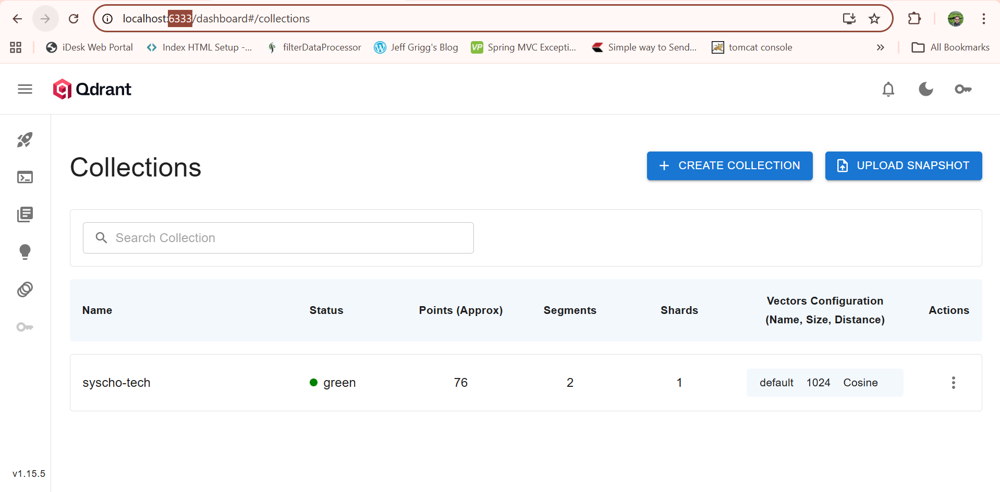

# Spring AI + Ollama + Qdrant — RAG System

A production-ready **Retrieval Augmented Generation (RAG)** system built with Spring Boot, Spring AI, Ollama (local LLM), and Qdrant (vector database). Supports ingesting documents from multiple file formats (PDF, Word, Markdown, JSON, Text) using a clean **Factory + Strategy** design pattern.

---

## Architecture

```
User Question
      │
      ▼
DocumentIngestionController / RagController
      │
      ▼
DocumentIngestionService ──► DocumentLoaderFactory
      │                              │
      │                    ┌─────────┴──────────┐
      │                    │  Strategy resolved  │
      │                    │  by file extension  │
      │                    └─────────┬──────────┘
      │                              │
      │              ┌───────────────┼───────────────┐
      │              ▼               ▼               ▼
      │        PdfLoader      TikaLoader       MarkdownLoader
      │        TextLoader     JsonLoader       ...
      │
      ▼
TokenTextSplitter (chunk documents)
      │
      ▼
VectorStore (Qdrant) ◄── mxbai-embed-large embeddings
      │
      ▼
RagService ──► similaritySearch(query)
      │
      ▼
Prompt + Retrieved Context
      │
      ▼
Ollama LLM (llama3.2:1b)
      │
      ▼
Final Response
```

---

## Project Structure

```
com.syscho.ai.rag
├── config/
│   └── ChatConfig.java                   # ChatClient + memory configuration
├── controller/
│   ├── DocumentIngestionController.java  # File upload & ingestion endpoints
│   └── RagController.java                # Question answering endpoint
├── dto/
│   └── IngestionResult.java              # Result record for ingestion response
├── loader/
│   ├── DocumentLoaderStrategy.java       # Strategy interface
│   ├── DocumentLoaderFactory.java        # Factory — resolves strategy by extension
│   ├── PdfDocumentLoaderStrategy.java    # .pdf
│   ├── MarkdownDocumentLoaderStrategy.java # .md
│   ├── TextDocumentLoaderStrategy.java   # .txt
│   ├── JsonDocumentLoaderStrategy.java   # .json
│   ├── TikaDocumentLoaderStrategy.java   # .docx .pptx .xlsx .html .odt
│   └── RagStaticDataLoader.java          # Optional static seed data loader
└── service/
    ├── DocumentIngestionService.java     # Orchestrates load → split → store
    └── RagService.java                   # Retrieval + LLM prompt execution
```

---

## Design Patterns

### Strategy Pattern
`DocumentLoaderStrategy` is a common interface. Each file type is an independent, swappable `@Component` implementation.

```java
public interface DocumentLoaderStrategy {
    List<Document> load(String resourcePath);
    String supportedExtension();
}
```

### Factory Pattern
`DocumentLoaderFactory` auto-discovers all strategies via Spring DI and resolves the correct one by file extension — no `if/else` chains.

```java
// Zero code changes needed to support new formats
// Just add a new @Component implementing DocumentLoaderStrategy
DocumentLoaderStrategy strategy = loaderFactory.getStrategy("report.pdf");
List<Document> docs = strategy.load("classpath:/docs/report.pdf");
```

### Open/Closed Principle
To add a new format (e.g. CSV), simply create a new `@Component`:
```java
@Component
public class CsvDocumentLoaderStrategy implements DocumentLoaderStrategy {
    @Override public String supportedExtension() { return "csv"; }
    @Override public List<Document> load(String path) { ... }
}
```
The factory picks it up automatically — **zero changes to existing code**.

---

## Supported File Formats

| Format | Extensions | Reader |
|--------|------------|--------|
| PDF | `.pdf` | `PagePdfDocumentReader` |
| Word | `.docx`, `.doc` | `TikaDocumentReader` |
| PowerPoint | `.pptx`, `.ppt` | `TikaDocumentReader` |
| Excel | `.xlsx`, `.xls` | `TikaDocumentReader` |
| HTML | `.html`, `.htm` | `TikaDocumentReader` |
| Markdown | `.md` | `MarkdownDocumentReader` |
| Plain Text | `.txt` | `TextReader` |
| JSON | `.json` | `JsonReader` |

---

## Prerequisites

- Java 21+
- Maven 3.8+
- Docker

---

## Run Required Services

### Ollama (Local LLM)

```bash
# Pull and run Ollama
docker run -d --name ollama -p 11434:11434 -v ollama:/root/.ollama ollama/ollama

# Download required models
docker exec -it ollama ollama pull llama3.2:1b
docker exec -it ollama ollama pull mxbai-embed-large
```

Verify Ollama is running:
```bash
curl http://localhost:11434/api/tags
```

### Qdrant (Vector Database)

```bash
docker run -d \
  --name qdrant \
  -p 6333:6333 \
  -p 6334:6334 \
  qdrant/qdrant
```

Verify Qdrant dashboard: [http://localhost:6333/dashboard](http://localhost:6333/dashboard)

---

## Maven Dependencies

```xml
<dependencyManagement>
    <dependencies>
        <dependency>
            <groupId>org.springframework.ai</groupId>
            <artifactId>spring-ai-bom</artifactId>
            <version>1.0.0</version>
            <type>pom</type>
            <scope>import</scope>
        </dependency>
    </dependencies>
</dependencyManagement>

<dependencies>
    <!-- Spring Boot -->
    <dependency>
        <groupId>org.springframework.boot</groupId>
        <artifactId>spring-boot-starter-web</artifactId>
    </dependency>

    <!-- Ollama LLM + Embeddings -->
    <dependency>
        <groupId>org.springframework.ai</groupId>
        <artifactId>spring-ai-ollama-spring-boot-starter</artifactId>
    </dependency>

    <!-- Qdrant Vector Store -->
    <dependency>
        <groupId>org.springframework.ai</groupId>
        <artifactId>spring-ai-qdrant-store-spring-boot-starter</artifactId>
    </dependency>

    <!-- Document Readers -->
    <dependency>
        <groupId>org.springframework.ai</groupId>
        <artifactId>spring-ai-pdf-document-reader</artifactId>
    </dependency>
    <dependency>
        <groupId>org.springframework.ai</groupId>
        <artifactId>spring-ai-tika-document-reader</artifactId>
    </dependency>
    <dependency>
        <groupId>org.springframework.ai</groupId>
        <artifactId>spring-ai-markdown-document-reader</artifactId>
    </dependency>
    <!-- TextReader and JsonReader are included in spring-ai-core (no extra dep needed) -->
</dependencies>
```

---

## Configuration

`application.yaml`

```yaml
server:
  port: 8088

spring:
  application:
    name: spring-ollama-rag

  ai:
    ollama:
      chat:
        model: llama3.2:1b
      embedding:
        model: mxbai-embed-large
    vectorstore:
      qdrant:
        initialize-schema: true
        host: localhost
        port: 6334
        collection-name: syscho-tech
```

---

## API Reference

### Upload & Ingest a Document

```bash
# Upload any supported file
curl -X POST http://localhost:8088/api/documents/upload \
  -F "file=@/path/to/document.pdf"
```

Response:
```json
{
  "source": "file:/tmp/rag-upload-document.pdf",
  "rawDocuments": 12,
  "chunks": 47,
  "success": true,
  "errorMessage": null
}
```

### Ingest from Classpath Path

```bash
curl -X POST http://localhost:8088/api/documents/ingest \
  -H "Content-Type: application/json" \
  -d '{"path": "classpath:/docs/guide.pdf"}'
```

### Ingest Multiple Files (Batch)

```bash
curl -X POST http://localhost:8088/api/documents/ingest-batch \
  -H "Content-Type: application/json" \
  -d '{
    "paths": [
      "classpath:/docs/guide.pdf",
      "classpath:/docs/notes.md",
      "classpath:/data/products.json"
    ]
  }'
```

### Ask a Question (RAG)

```bash
curl "http://localhost:8088/rag?question=What+is+Spring+AI&conversationId=user-123"
```

Response:
```
Spring AI is a framework used to integrate large language models into Spring Boot applications...
```

---

## How RAG Works in This Project

1. **Ingest** — A document is uploaded and the `DocumentLoaderFactory` selects the correct `DocumentLoaderStrategy` based on file extension.
2. **Split** — `TokenTextSplitter` breaks the document into overlapping chunks optimised for embedding.
3. **Embed & Store** — Each chunk is embedded via `mxbai-embed-large` and stored in Qdrant.
4. **Retrieve** — At query time, `VectorStore.similaritySearch(query)` fetches the most semantically relevant chunks.
5. **Generate** — The retrieved context is injected into the system prompt and sent to Ollama (`llama3.2:1b`) for a grounded response.

```java
// RagService — retrieval + prompt construction
List<Document> documents = vectorStore.similaritySearch(query);
String context = documents.stream()
        .map(Document::getText)
        .collect(Collectors.joining("\n"));

String systemPrompt = """
    Answer the question using the context below.
    Context:
    %s
    """.formatted(context);
```
---

## Test Query

```
GET /rag/database?question=What did I order last?&customerId=CUST001
# → Aarav's boAt Airdopes placed on Jan 30

GET /rag/database?question=Do I have any cancelled orders?&customerId=CUST002
# → Priya's Lakme Face Serum cancelled

GET /rag/database?question=What is in my cart?&customerId=CUST003
# → Rohit's Noise ColorFit + Prestige Kettle

```
---

## Run the Application

```bash
mvn spring-boot:run
```

The application starts on port **8088**.

---

## Troubleshooting

| Issue | Fix |
|-------|-----|
| Ollama model not found | Run `docker exec -it ollama ollama pull llama3.2:1b` |
| Qdrant connection refused | Check port `6334` (gRPC) is exposed, not just `6333` (HTTP) |
| Empty RAG responses | Ingest documents first before querying |
| Unsupported file type error | Check `DocumentLoaderFactory.getSupportedExtensions()` for the full list |
| `mxbai-embed-large` not found | Run `docker exec -it ollama ollama pull mxbai-embed-large` |