# Spring AI Tool Calling

A production-ready Spring AI system with dynamic tool discovery, chat memory, and external API integration.

---

## Stack

- Spring Boot + Spring AI (`ChatClient`)
- Ollama / OpenAI LLM
- Tool annotations (`@Tool`, `@ToolParam`)
- H2 / PostgreSQL chat memory

---

## Project Structure

```
com.syscho.ai.tools
├── config
│   ├── ChatConfig.java          # ChatClient, memory, advisors
│   └── ToolRegistry.java        # Auto tool discovery
├── controller
│   └── ChatController.java      # REST entry point
└── tools
    ├── api/FetchGetTool.java     # Generic GET tool
    ├── time/TimeTool.java        # Current time tool
    └── weather/
        ├── WeatherTool.java
        └── WeatherApiProperties.java
```

---

## How It Works

```
Request → ChatController → ChatClient → Advisors → LLM
                                                    │
                                          ┌─────────┴─────────┐
                                     No tool             Tool needed
                                          │                    │
                                   Direct response      ToolRegistry
                                                              │
                                                       ToolCallback
                                                              │
                                                        Tool result
                                                              │
                                                     LLM final response
```

---

## Key Components

### ChatController
Accepts `userMessage` + `conversationId`, delegates to `ChatClient`.

### ChatConfig
Wires `ChatClient` with:
- `MessageWindowChatMemory` (last 20 messages, isolated by `conversationId`)
- `MessageChatMemoryAdvisor`
- `SimpleLoggerAdvisor`
- All tools via `defaultToolCallbacks(toolCallbacks)`

### ToolRegistry
Auto-discovers all Spring beans with `@Tool` methods — no manual wiring needed.

```java
ctx.getBeansOfType(Object.class).values().stream()
   .filter(bean -> hasToolAnnotatedMethods(bean))
   .flatMap(bean -> Arrays.stream(ToolCallbacks.from(bean)))
   .toList();
```

---

## Spring AI Internal Classes

### `ToolCallingManager` → `DefaultToolCallingManager`

Auto-registered as a `@Bean` by Spring AI. You never call it directly — `ChatClient` delegates to it when the LLM returns a tool call.

**Internal method flow:**

| Method | What it does |
|--------|-------------|
| `executeToolCalls(prompt, chatResponse)` | Entry point — finds `Generation` with non-empty `ToolCalls` |
| `buildToolContext()` | Injects `TOOL_CALL_HISTORY` into context map |
| `executeToolCall()` | Loops over each `AssistantMessage.ToolCall` |
| `toolCallbackResolver.resolve(name)` | Finds `ToolCallback` via `DelegatingToolCallbackResolver` |
| `toolCallback.call(args, context)` | Invokes your `@Tool` method via reflection |
| `ToolExecutionExceptionProcessor` | Catches `ToolExecutionException` → converts to String |
| `buildConversationHistoryAfterToolExecution()` | Appends `AssistantMessage` + `ToolResponseMessage` to history |
| Returns `ToolExecutionResult` | Holds updated `conversationHistory` + `returnDirect` flag |

**Key internals worth knowing:**
- Each tool call is wrapped in a **Micrometer observation** for metrics and tracing
- `returnDirect = true` on a tool skips the second LLM call — result goes straight to user
- Multiple tool calls in one LLM response are all executed in the same loop before re-sending

**Override only when needed:**

```java
@Bean
public ToolCallingManager toolCallingManager() {
    return DefaultToolCallingManager.builder()
            .toolCallbackResolver(new DelegatingToolCallbackResolver(List.of()))
            .toolExecutionExceptionProcessor(
                DefaultToolExecutionExceptionProcessor.builder().build()
            )
            .build();
}
```



---

## Tools

| Tool | Trigger | Description |
|------|---------|-------------|
| `FetchGetTool` | Any URL query | Executes external GET APIs |
| `TimeTool` | "What time is it?" | Returns current system time |
| `WeatherTool.getCurrentWeather` | "Weather in X?" | Current conditions |
| `WeatherTool.getWeatherForecast` | "Forecast for X?" | 1–14 day forecast |

---

## Configuration

```yaml
weather:
  api:
    key: ${WEATHER_API_KEY}
    base-url: https://api.weatherapi.com/v1

spring:
  ai:
    openai:
      api-key: ${OPEN_AI_KEY}
```

Set `WEATHER_API_KEY` and `OPEN_AI_KEY` as environment variables in your run configuration.

---

## Sample Request

```
GET /chat/tools?userMessage=What is the weather in Hyderabad?
Header: conversationId: session-123
```

---

## Diagrams





---

## Notes

- Tool `description` must be clear — LLM uses it to pick the right tool
- Input validation lives inside each tool, not in the controller
- Each tool round-trip adds latency (~500ms–2s depending on LLM)
- `returnDirect = true` on `@Tool` skips the second LLM call — use for simple lookups